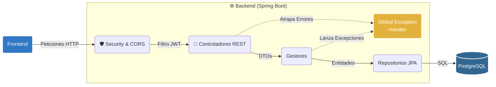
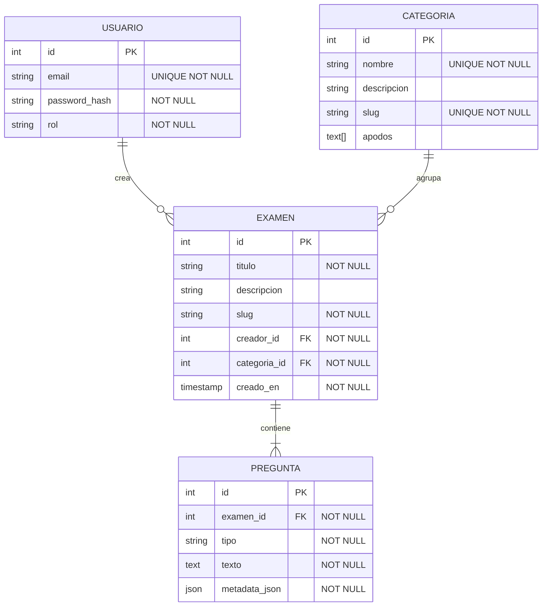

# 🚀 Gestor de Evaluaciones Web

Sistema de gestión de exámenes y cuestionarios dinámicos. Desarrollado como parte del Challenge Técnico para Software Engineer Web en AranguriApps.

## 🎯 Objetivo

La aplicación permite la creación, organización y ejecución de cuestionarios agrupados por categorías temáticas. El enfoque principal del desarrollo estuvo puesto en garantizar una arquitectura backend robusta mediante la separación de responsabilidades y un modelo de datos flexible para soportar distintos formatos de evaluación.

## 🛠️ Stack Tecnológico y Arquitectura

* **Base de Datos:** PostgreSQL.
* **Backend:** Java con Spring Boot. Arquitectura en capas con aislamiento de controladores; la lógica de negocio y validaciones se centralizan en clases `Gestor`.
* **Frontend:** React / Next.js.
* **Seguridad:** Autenticación y autorización mediante JWT vía filtros de Spring Security.

**Nota sobre herramientas:** Se implementó asistencia de LLMs en el ciclo de desarrollo para el modelado inicial de arquitectura (Mermaid as Code) y la creación de un pipeline automatizado de *data parsing*, transformando exámenes en texto plano a estructuras JSON estandarizadas para la base de datos.

## 🏗️ Arquitectura del Sistema

El backend está diseñado siguiendo una arquitectura en capas estricta para garantizar escalabilidad y mantenibilidad. El flujo de datos asegura que la capa de presentación interactúe exclusivamente mediante DTOs, delegando las reglas de negocio a la capa de `Gestores` y aislando el modelo de dominio. 

Adicionalmente, se implementó un `Global Exception Handler` para interceptar errores de forma centralizada y estandarizar las respuestas HTTP.
<details>
  <summary><b>Ver Diagrama de Arquitectura</b></summary>


</details>

## 📊 Modelo de Datos

El modelo relacional aprovecha características específicas de PostgreSQL para maximizar la flexibilidad:
* Uso de columnas `json` (`metadata_json`) para almacenar la configuración específica de cada tipo de pregunta sin alterar el esquema.
* Uso de arreglos de texto (`text[]`) para búsquedas eficientes por múltiples alias en las categorías.

<details>
  <summary><b>Ver Diagrama de Entidad Relación (DER)</b></summary>


</details>

## 🗺️ Roadmap del Proyecto

### Fase 0: Planeamiento (Completado)
- [x] **Diseño de Arquitectura:** Definición de flujos, diagramas de componentes y modelo relacional.
- [x] **Setup de Repositorio:** Estructura inicial, documentación y selección de stack tecnológico.

### Fase 1: MVP (En proceso)
- [ ] Autenticación y autorización basada en roles (JWT).
- [ ] Arquitectura core de backend y endpoints de gestión.
- [ ] Soporte polimórfico para preguntas mediante metadata JSON.

### Fase 2: Motor de Evaluación (En progreso)
- [ ] **Motor de Aleatoriedad:** Shuffling dinámico de preguntas y opciones en tiempo de ejecución.
- [ ] **Sistema de Ponderación:** Soporte para puntajes parciales en respuestas complejas.
- [ ] **Ingesta Masiva:** Endpoint y UI para importación masiva de cuestionarios vía archivos JSON.

### Fase 3: Funcionalidades Sociales (Backlog)
- [ ] **Sistema de Contribuciones:** Flujo de revisión para que los usuarios puedan proponer preguntas a exámenes de terceros.

---

## ⚙️ Ejecución Local

1. Clonar el repositorio: `git clone [URL]`
2. Configurar las variables de entorno en `.env` (ver `.env.example` para credenciales de PostgreSQL).
3. Levantar el Backend:
```bash
   ./mvnw spring-boot:run
   ```
4. Instalar dependencias y levantar el Frontend:
```bash
   cd frontend
   npm install
   npm run dev
   ```