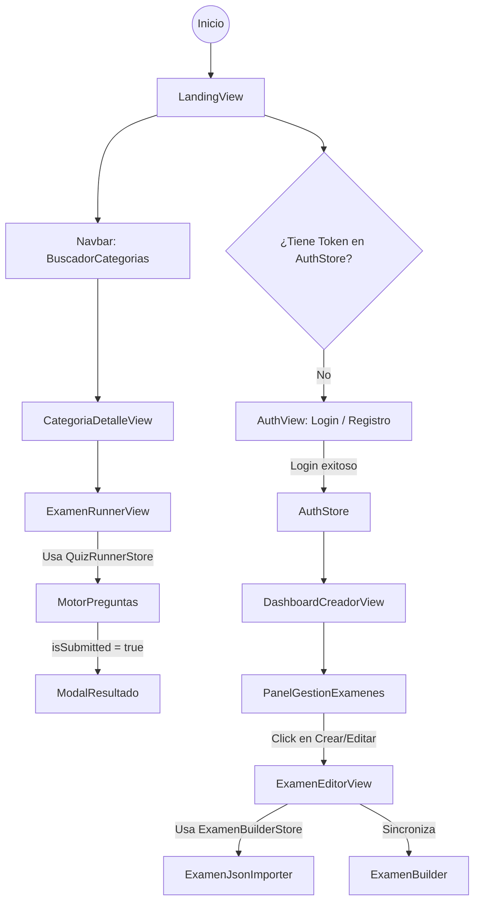

# Flujo de Usuario - QuizForge

## Objetivo

Este documento describe el recorrido del usuario dentro de la aplicación **QuizForge**, mostrando cómo interactúan las distintas vistas, los Stores globales y el motor de resolución de exámenes.

---

# Diagrama de Flujo

---

# Análisis del Flujo

## 1. Autenticación como Fuente de Verdad

El `AuthStore` es el único responsable de determinar si un usuario está autenticado.

### Flujo esperado

* El usuario ingresa a la aplicación.
* Se verifica la existencia de un JWT válido.
* Si existe:

    * Se habilitan las rutas protegidas.
* Si no existe:

    * El usuario es redirigido a `AuthView`.

Además, cualquier respuesta HTTP **401** o **403** proveniente del backend debe provocar automáticamente:

1. Eliminación del token.
2. Limpieza del `AuthStore`.
3. Logout forzado.
4. Redirección hacia `AuthView`.

---

## 2. Ciclo de Vida del Examen

El `QuizRunnerStore` representa un estado temporal que únicamente existe mientras el usuario está realizando un examen.

### Flujo

1. El usuario ingresa a `ExamenRunnerView`.
2. Se inicializa el estado del examen.
3. Las respuestas se almacenan en `QuizRunnerStore`.
4. El usuario puede modificar respuestas libremente.
5. Al enviar el examen:

    * Se bloquea la edición (`isSubmitted = true`).
    * Se envían las respuestas al backend.
    * Se recibe el puntaje (`score`).
6. Al abandonar o finalizar el examen:

    * Se limpia completamente el `QuizRunnerStore`.

---

## 3. Componentes Smart vs Dumb

La arquitectura sigue una separación clara de responsabilidades.

### Componentes Smart

Responsables de:

* Realizar llamadas a la API.
* Interactuar con Zustand.
* Gestionar lógica de negocio.
* Orquestar componentes hijos.

Ejemplos:

* `CategoriaDetalleView`
* `DashboardCreadorView`
* `ExamenRunnerView`

---

### Componentes Dumb

Responsables únicamente de la presentación.

Características:

* No realizan fetch.
* No conocen Zustand.
* Reciben datos mediante props.
* Emiten eventos mediante callbacks.

Ejemplos:

* `ExamenCard`
* `PreguntaCard`
* `BotoneraAcciones`
* `ModalResultado`

---

# Vistas Principales

## A. LandingView

### Objetivo

Ser el punto de entrada principal para descubrir contenido.

### Diseño esperado

* Diseño limpio y moderno.
* Buscador prominente en la parte superior.
* Tarjetas de categorías organizadas en grid.
* Colores llamativos para cada categoría.
* Navegación sencilla e intuitiva.
#### Condiciones especiales
* Debe mostrar un progress tipo "Cargando..." con animación en los puntitos para otorgar feedback visual al usuario (Este componente junto con el de auth pueden verse afectados por el cold start del deploy futuro)
* Debe mostrar un mensaje de error central si no hay resultados para su búsqueda

---

## B. AuthView

### Objetivo

Gestionar el inicio de sesión y el registro.

### Diseño esperado

* Formulario centrado.
* Diseño minimalista.
* Cambio fluido entre Login y Registro.
* Validaciones visuales claras.
* Feedback inmediato de errores.

#### Consideraciones especiales
* Debe mostrar que se está realizando la petición girando una ruedita en el botón de "iniciar sesión" ya que puede verse afectado por el cold start en deploy

---

## C. CategoriaDetalleView

### Objetivo

Mostrar todos los exámenes pertenecientes a una categoría.

### Diseño esperado

* Grid responsive de exámenes.
* Barra de búsqueda.
* Filtros por autor.
* Paginación

---

## D. ExamenRunnerView

### Objetivo

Ofrecer una experiencia enfocada exclusivamente en resolver el examen.

### Diseño esperado

* Pantalla completa.
* Sin elementos distractores.
* Barra de progreso fija.
* Navegación clara entre preguntas.
* Botón de entrega siempre visible.
* Modal final con resultados y estadísticas.

#### Consideraciones especiales

* Habrá un pequeño timer en el margen superior izquierdo
* Este timer se implementará mediante usePageVisibility y un custom hook
* El timer avanza mientras se esté en la pantalla y se frena cuando el usuario la minimiza o se sale
* El timer se detiene y desaparece cuando el usuario entrega el examen

#### Prevención de Pérdida de Datos (Guards)
* Implementar un aviso de confirmación (tipo `window.confirm` o un custom modal interceptando la navegación de React Router) si el usuario intenta abandonar la página, recargarla o cerrar la pestaña mientras haya respuestas cargadas o cambios sin guardar en el Store.
---

## E. ExamenEditorView
**Ruta:** `/dashboard/crear-examen`
**Propósito:** Contenedor principal para la creación de un nuevo examen. Orquesta la herramienta de importación rápida y el editor manual.

---

### Estado de Construcción: `ExamenBuilderStore` (Zustand)
**Propósito:** Almacenar el borrador temporal del examen, aislando la lógica de negocio y las transformaciones de datos de la interfaz visual.
* **Estado:**
    * `titulo` (String)
    * `descripcion` (String)
    * `preguntas` (Array de `PreguntaDraftDTO`)
    * `errorImportacion` (String | null)
* **Acciones Principales:**
    * `cargarDesdeJson(jsonString)`: Parsea el texto ingresado, valida la estructura y actualiza el array de preguntas.
    * `limpiarBorrador()`: Reinicia el estado al salir de la pantalla o al guardar con éxito en el servidor.

#### Prevención de Pérdida de Datos (Guards)
* Implementar un aviso de confirmación (tipo `window.confirm` o un custom modal interceptando la navegación de React Router) si el usuario intenta abandonar la página, recargarla o cerrar la pestaña mientras haya respuestas cargadas o cambios sin guardar en el Store.

---

## Sub-componentes

### 1. `ExamenJsonImporter` (Asistente de Importación)
**Propósito:** Proporcionar al usuario una plantilla base para usar con herramientas de IA externas y un área de carga para procesar la respuesta.
* **Dimensiones (Tailwind):** Debe ocupar aproximadamente el 50% del ancho (`w-full lg:w-1/2`) y un 25% del alto de la pantalla (`min-h-[25vh]`).
* **UI - Sección Plantilla (Markdown Render):** Un bloque visual tipo "Code Snippet" con un botón de "Copiar al portapapeles". Debe contener un *prompt* sugerido, por ejemplo:
  > "Actúa como un profesor. Transforma el siguiente texto en un array JSON estricto con esta estructura: `[{ "consigna": "...", "opciones": ["A", "B", "C"], "correcta": 1 }]`. No incluyas texto adicional fuera del JSON."
* **UI - Sección de Ingreso:** Un `textarea` de gran tamaño donde el usuario pegará el JSON devuelto por la IA.
* **Comportamiento:** Al presionar "Procesar", envía el string a la acción `cargarDesdeJson` del Store. Si falla, muestra el error de formato; si es exitoso, llena el editor manual.

* **Comportamiento y Validación Estricta:** Al presionar "Procesar", el componente no debe mutar el estado directamente. Debe intentar parsear el JSON y **validarlo utilizando un esquema de Zod** (ej. `examenDraftSchema`) que coincida estrictamente con los DTOs de Java.
    * Si la validación falla: Capturar el error de Zod y mostrar en la UI qué campo está mal (ej. "Falta la propiedad 'correcta' en la pregunta 2").
    * Si es exitoso: Enviar el array sanitizado a la acción `cargarDesdeJson` del Store.

### 2. `ExamenBuilder` (Editor Visual)
**Propósito:** Renderizar las preguntas actualmente cargadas en el Store.
* **UI/UX:** Se sincroniza reactivamente. Si el usuario procesa un JSON exitosamente en el `ExamenJsonImporter`, este componente se actualiza automáticamente mostrando todas las "tarjetas" de preguntas generadas para que el usuario pueda hacer revisiones manuales antes de hacer el POST final al backend.

---

## F. DashboardCreadorView

### Objetivo

Permitir la administración de exámenes creados por el usuario.

### Diseño esperado

* Tabla clara y ordenada.
* Acciones rápidas de edición.
* Botones visibles para crear, editar y eliminar (sujetos a restricciones del dominio).
* Buscador y filtros para facilitar la gestión.

---

# Lineamientos para la IA

Cuando se utilice una IA para generar el frontend, deben respetarse las siguientes reglas.
## Atributos de Testing
* Todos los componentes interactivos críticos (botones de submit, textareas de importación, tarjetas de preguntas) deben incluir atributos `data-testid` descriptivos para facilitar el testing automatizado en el futuro.
## Gestión de Estado

* Utilizar **Zustand** para el estado global.
* Utilizar `useState` únicamente para estado local del componente.

## Contratos de Datos (Zod y TypeScript)
* Todos los esquemas de validación de Zod (ej. `examenDraftSchema`) y las interfaces TypeScript deben alojarse en `/src/types/` o `/src/schemas/`.
* Deben ser un espejo estricto de los DTOs utilizados en el backend (ej. respetando si un campo se llama `categoriaId` en el JSON devuelto por la API).
---

## Separación de Responsabilidades

Respetar la arquitectura basada en:

* **Componentes Smart**

    * Obtienen datos.
    * Realizan fetch.
    * Acceden a Zustand.
    * Contienen lógica de negocio.

* **Componentes Dumb**

    * Presentan información.
    * Reciben props.
    * Emiten callbacks.
    * No conocen el backend.

---

